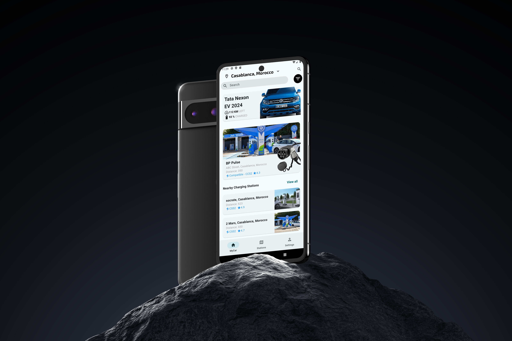

# EV Charging Stations Mobile Application

This project is a mobile application built using Flutter for EV charging stations. I built it based on a UI/UX design on Behance that I liked, and here is the design on Behance: [Behance Design](https://shorturl.at/ZJD4i).

## Pages

The mobile application contains three pages:

1. **Home Page**: Displays a picture with a little information about the car and the nearby stations.
2. **Details Page**: Provides more details about the car, such as distance, tire pressure, and more.
3. **Map Stations Page**: Shows all the stations on the map. A route is drawn between a car and one of those stations as a simulation of a production application. You can get more information about each station by clicking on it, which brings up a bottom sheet with details about the station, such as the chargers it has, their number, etc.

## Architecture

The application's architecture is based on the Bloc architecture, focusing solely on the presentation layer. This architecture helps maintain best practices, such as the separation of concerns between the UI and business logic.

## Code Quality

The code is modular, ensuring maintainability and scalability. Clean code principles are respected as much as possible, which is evident in the naming conventions for variables, functions, classes, etc.

## Known Issues

In the code for the car image on the home page, there's a small issue with responsiveness. I'll discuss this in upcoming articles and posts, focusing on how to handle several children in complex UIs using the `CustomMultiChildLayout` class instead of the `Stack` class.

## API Integration

On the map stations page, a route is drawn between a car and one of the stations using Open Route Service. I will discuss the API in upcoming posts and articles on LinkedIn, Medium, and YouTube.

